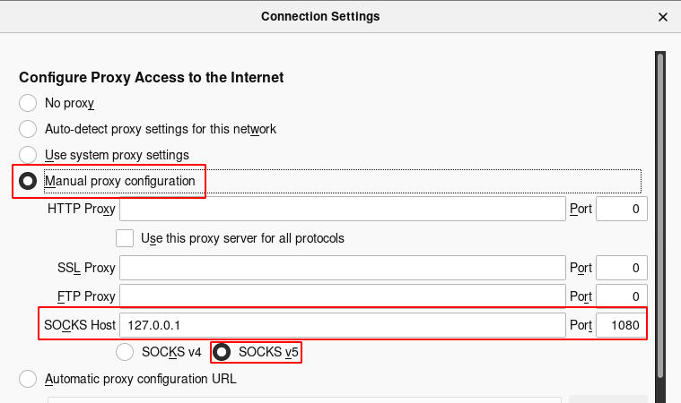

# SSH

## Create SSH keys

```text
ssh-keygen -t ed25519
```

## SOCKS proxy

```text
ssh -D 1080 -q -C -N user@host
```

1. `-D 1337`: open a SOCS proxy on local port `:1080`
2. `-C`: compress data in the tunnel, save bandwidth
3. `-q`: quite mode, don't output anything locally
4. `-N`: do not execute remote commands or open shell

Firefox setting




## OpenSSH on Windows

### WSL

```bash
# To remove old config file and to enable GSSAPIAuthentication
sudo apt remove openssh-server
sudo apt install openssh-server

sudo service ssh --full-restart
```

## References

1. [socks proxy linux ssh bypass content filters](https://ma.ttias.be/socks-proxy-linux-ssh-bypass-content-filters/)

